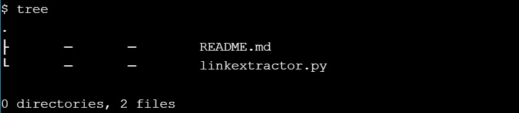
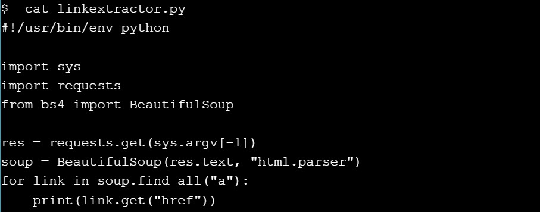
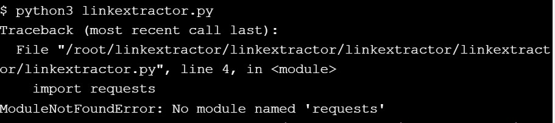

# Step 0: Basic Link Extractor Script

``git checkout step0``

``tree``

``cat linkextractor.py``

``./linkextractor.py http://example.com/``

``ls -l linkextractor.py``

``python3 linkextractor.py``

