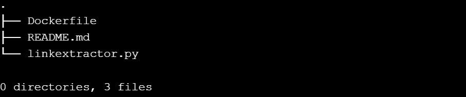
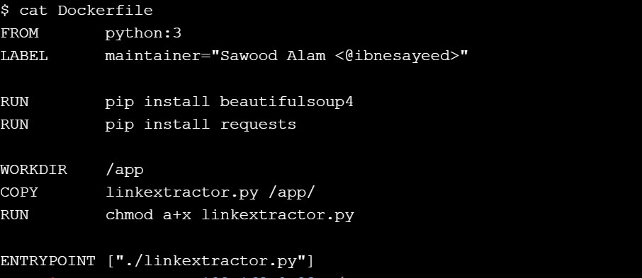
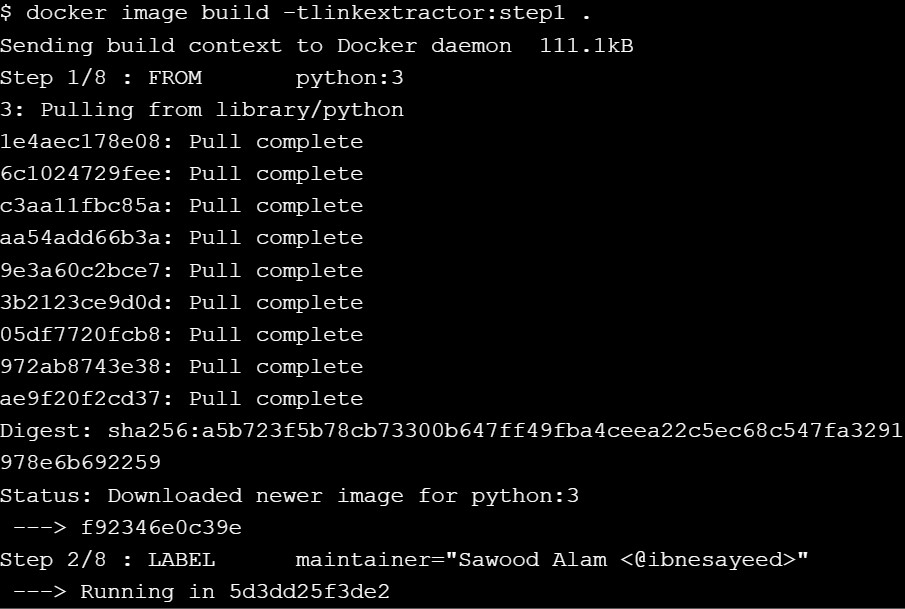
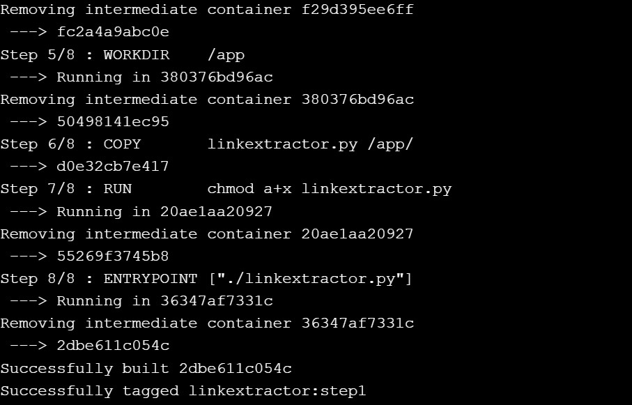
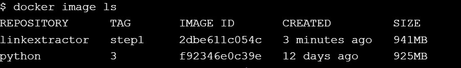
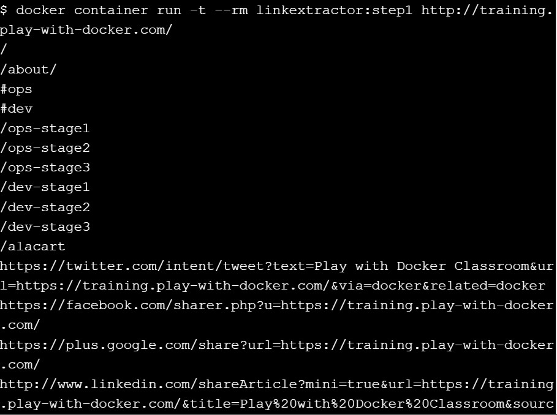
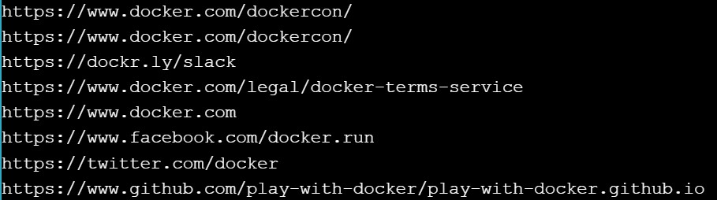

# Step 1: Containerized Link Extractor Script

``git checkout step1``

``tree``

``git checkout step1``

``docker image build -t linkextractor:step1 .``

``docker image ls``

``docker container run -it --rm linkextractor:step1 http://example.com/``

