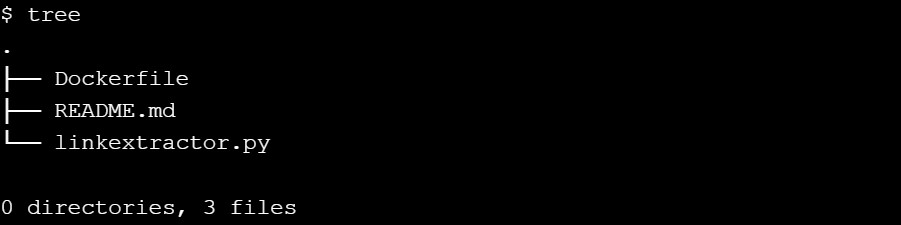
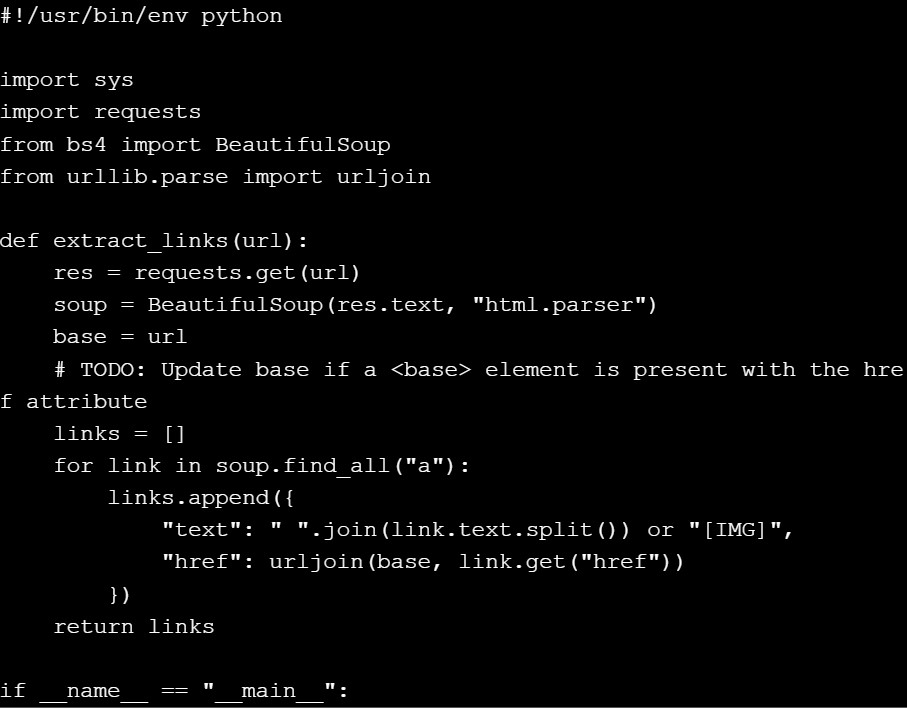
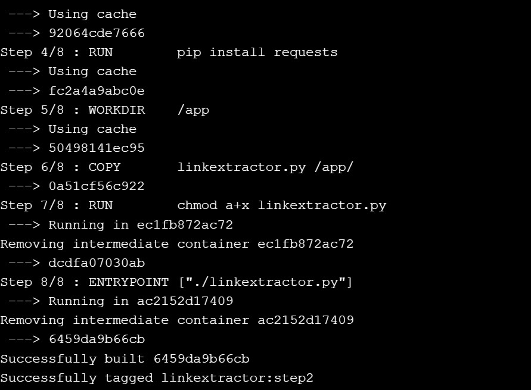
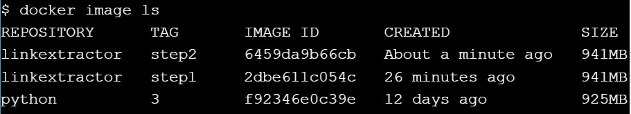
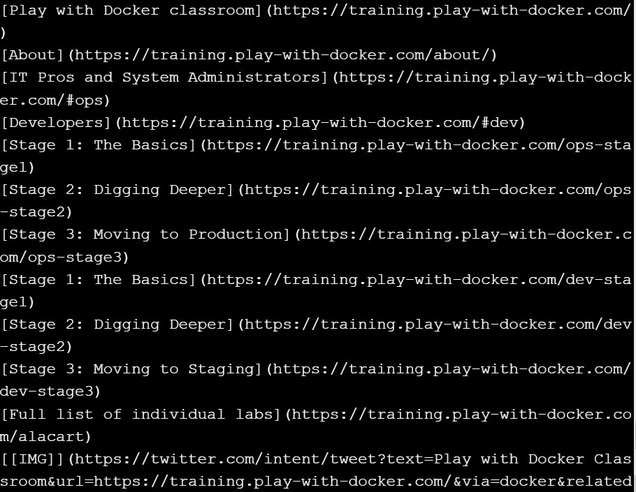
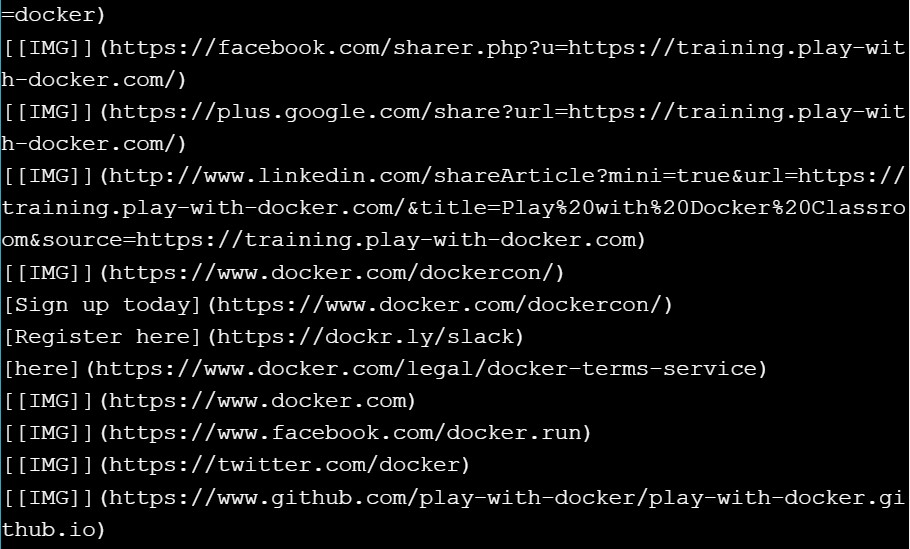
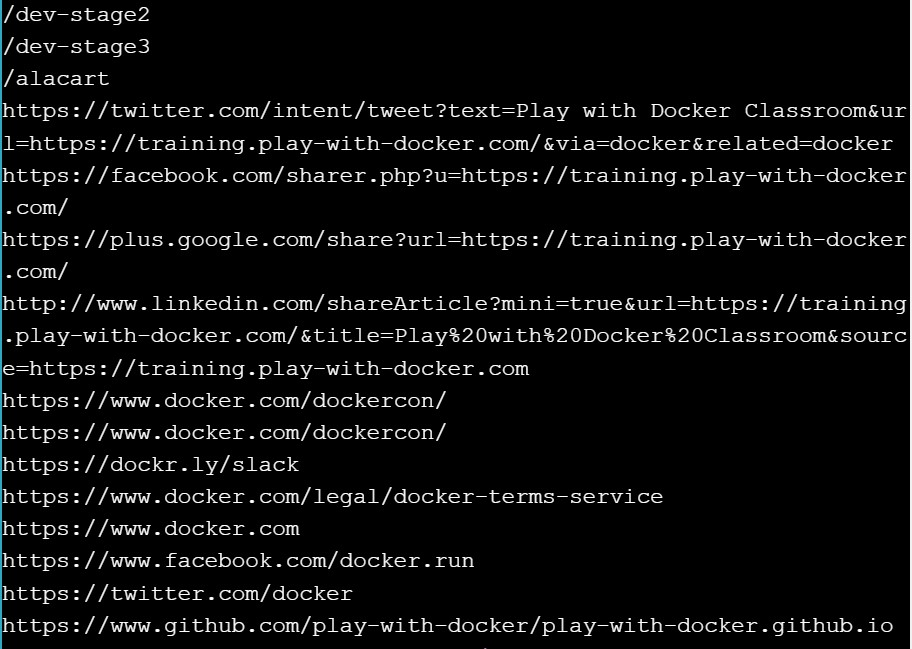

# Step 2: Link Extractor Module with Full URI and Anchor Text

``git checkout step2``

``tree``

``cat linkextractor.py``

``docker image build -t linkextractor:step2 .``

``docker image ls``

``docker container run -it --rm linkextractor:step2 https://training.play-with-docker.com/``

``docker container run -it --rm linkextractor:step1 https://training.play-with-docker.com/``

