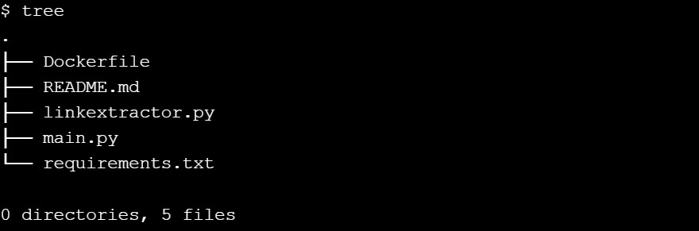
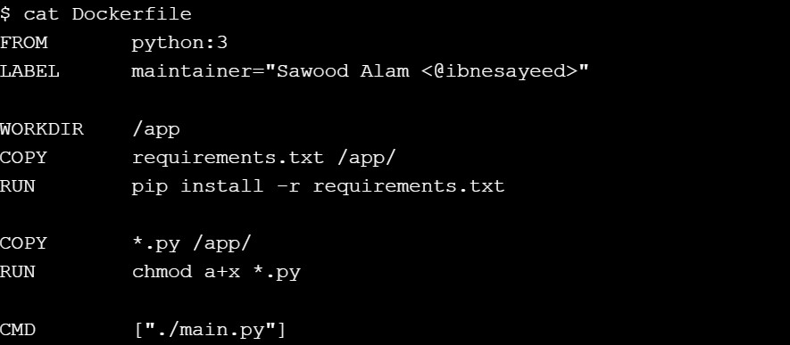
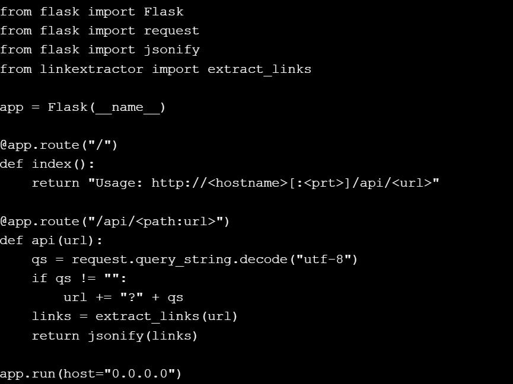
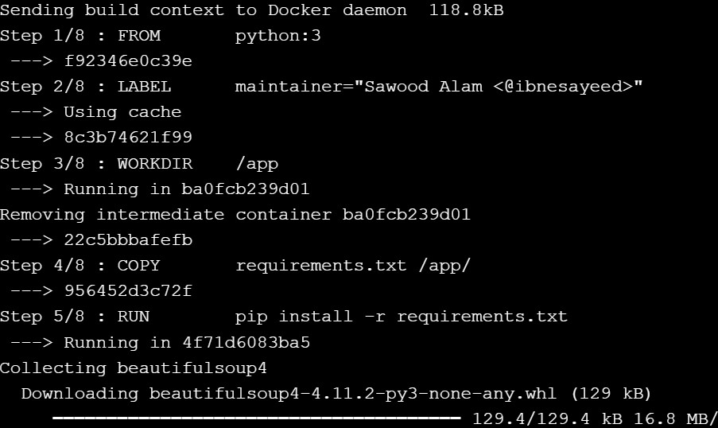
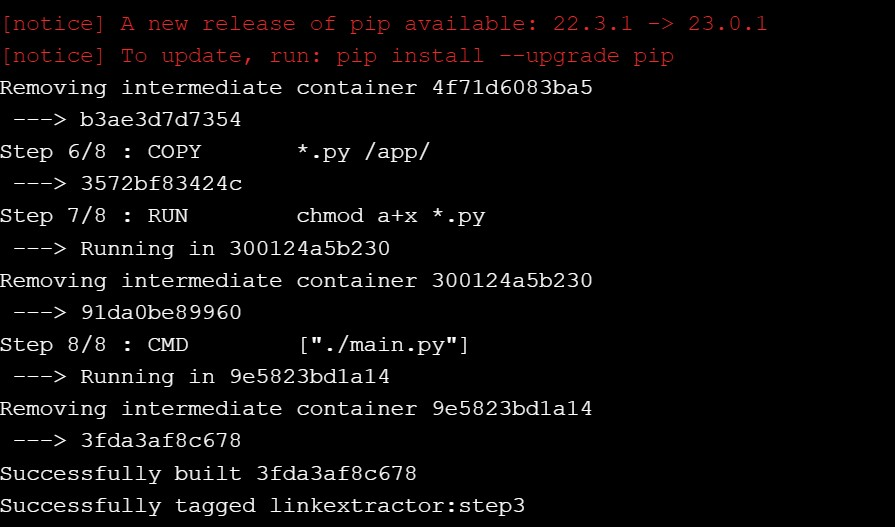
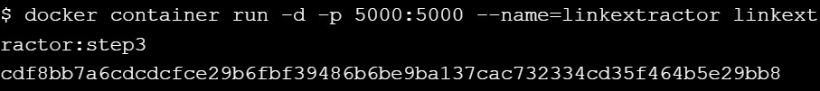
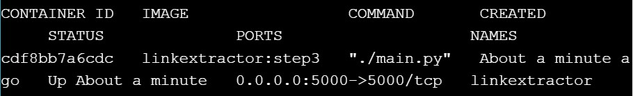
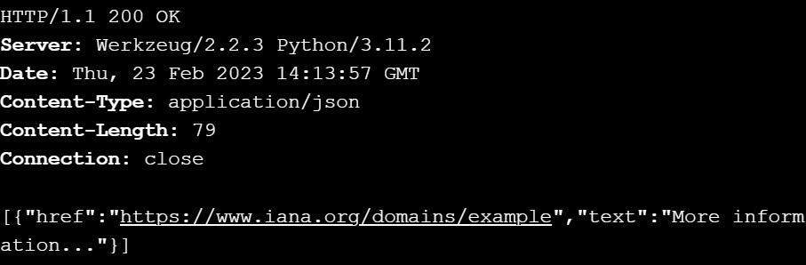
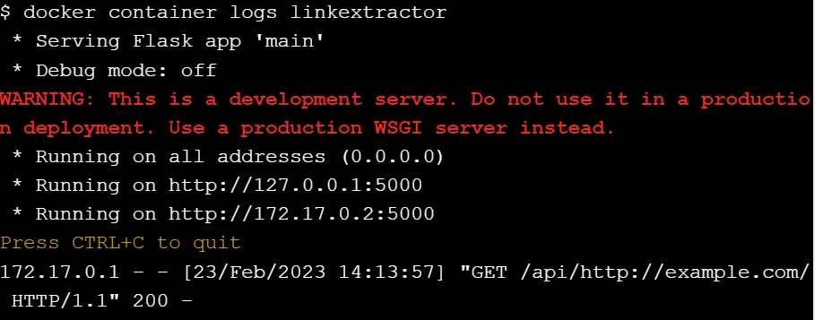
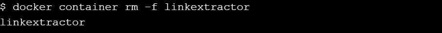

# Step 3: Link Extractor API Service

``git checkout step3``

``tree``

``cat Dockerfile``

``cat main.py``

``docker image build -t linkextractor:step3 .``

``docker container run -d -p 5000:5000 --name=linkextractor linkextractor:step3``

``docker container ls``

``curl -i http://localhost:5000/api/http://example.com/``

``docker container logs linkextractor``

``docker container rm -f linkextractor``

