# Step 4: Link Extractor API and Web Front End Services

``git checkout step4``

``tree``

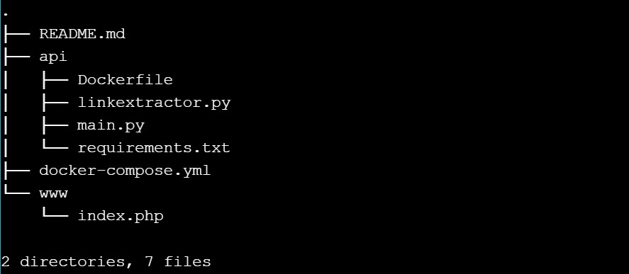

``cat docker-compose.yml``

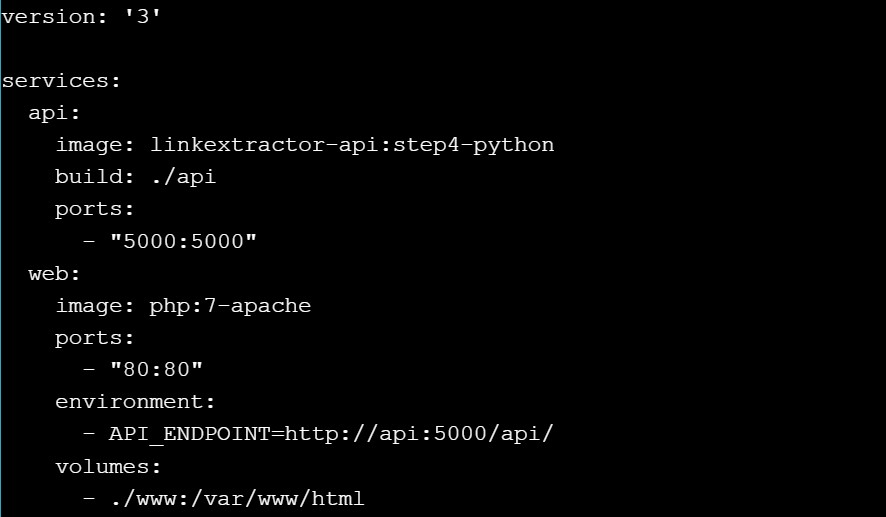

``cat www/index.php``

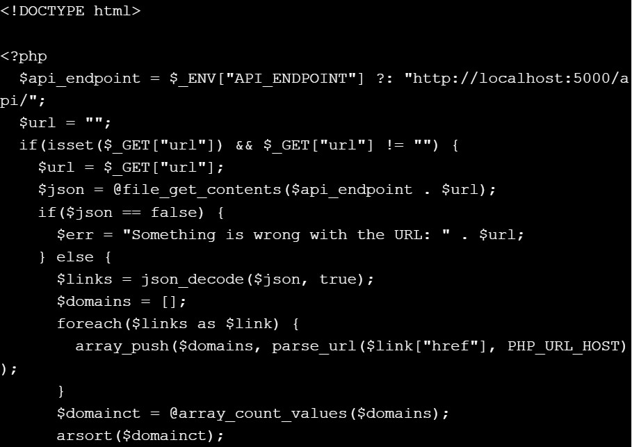
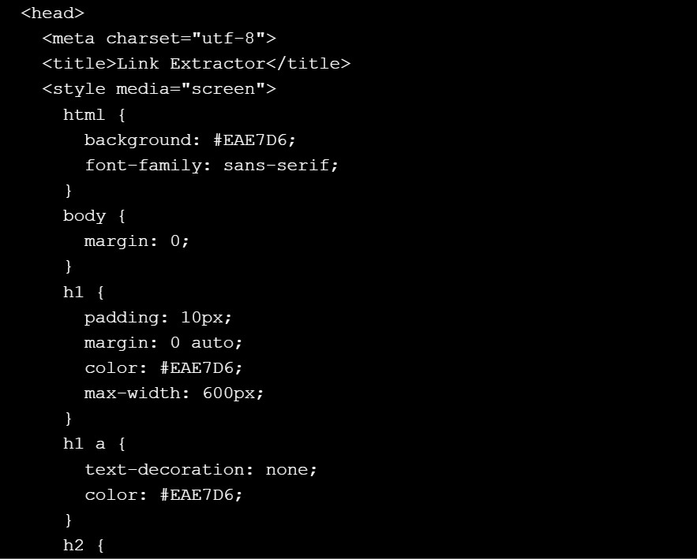
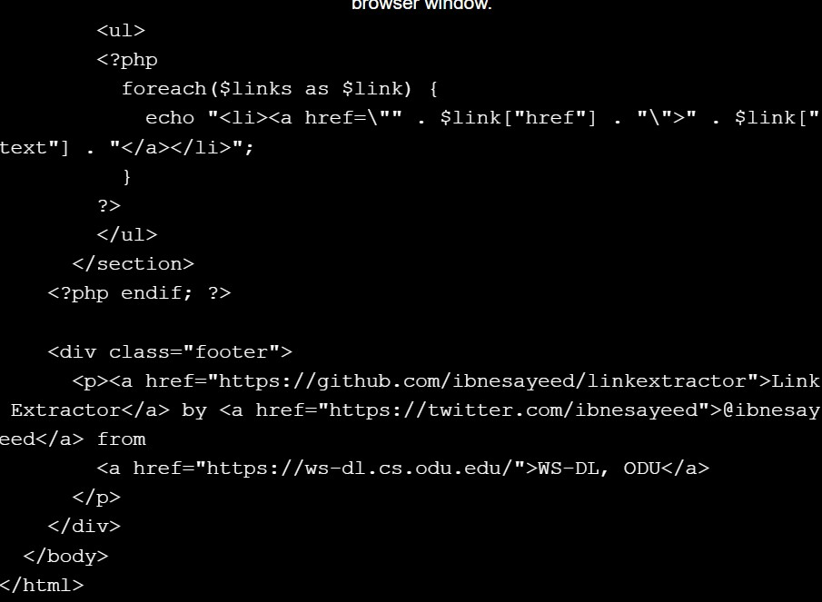

``docker-compose up -d --build``

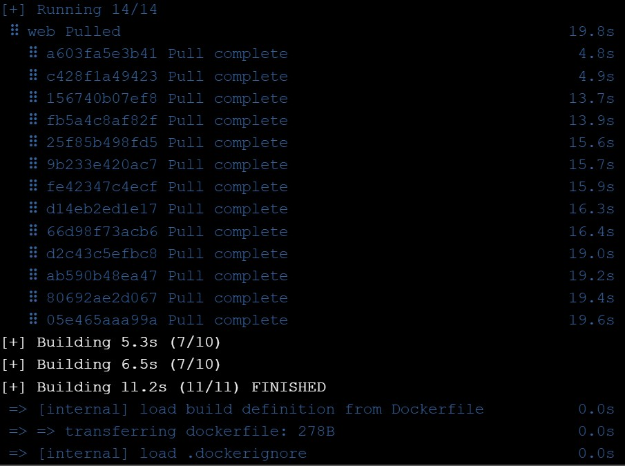
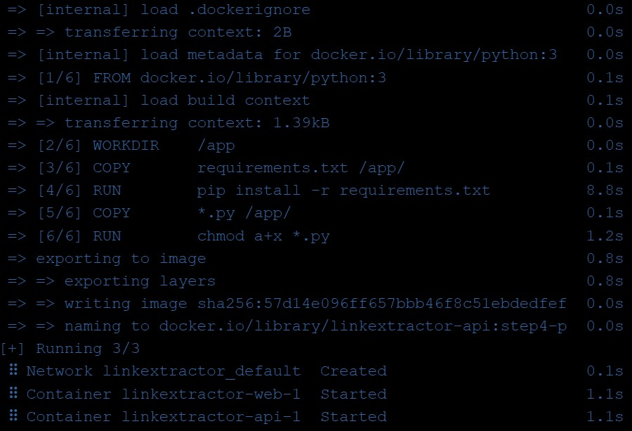

``docker container ls``

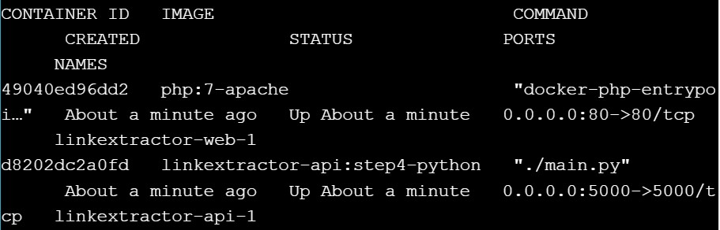

``curl -i http://localhost:5000/api/http://example.com/``

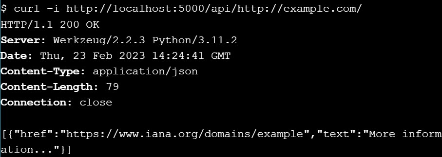

``git reset --hard``

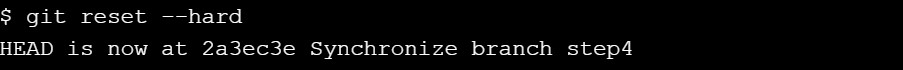

``docker-compose down``

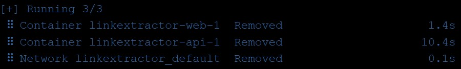

