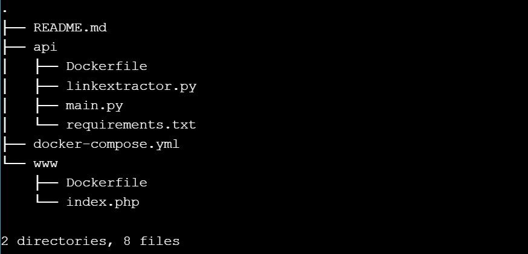
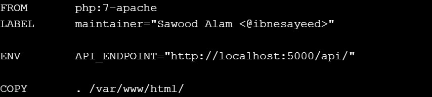
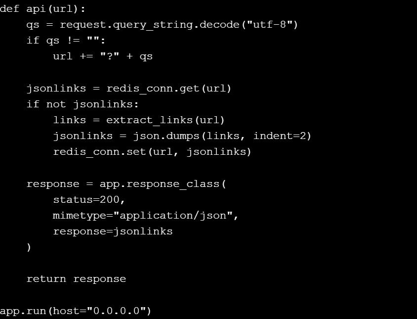
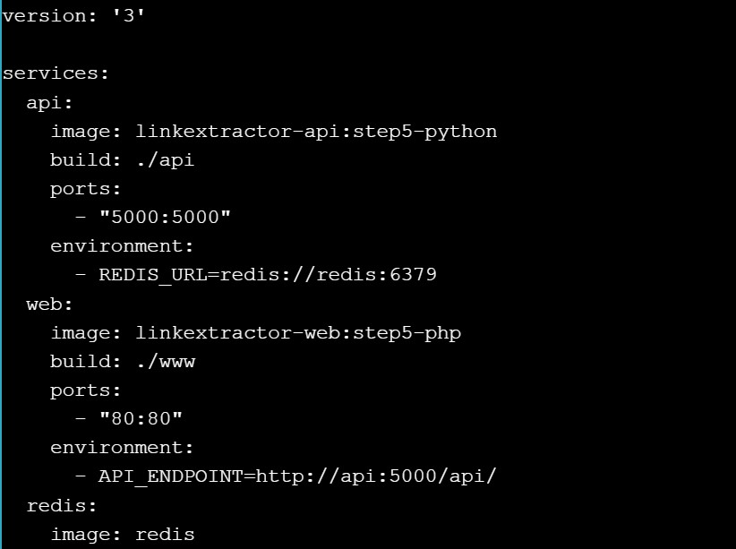
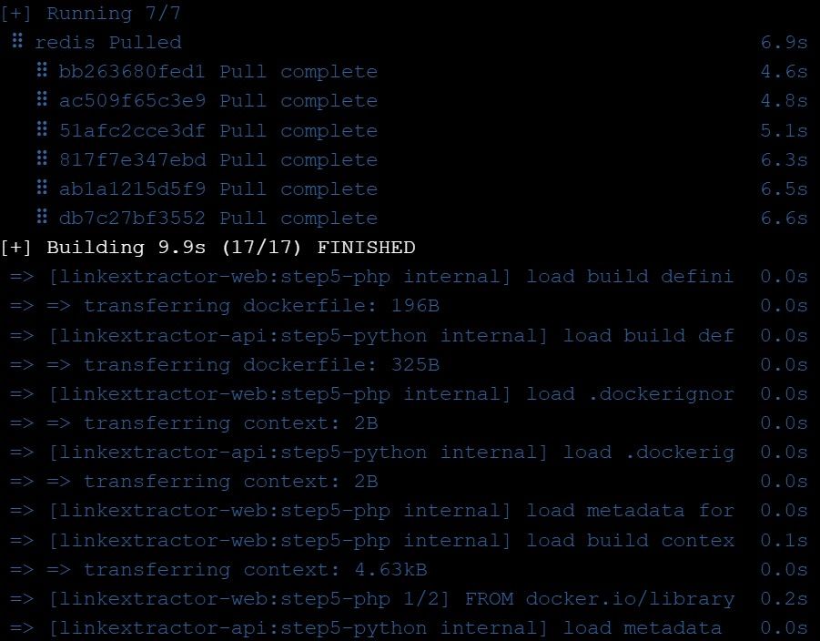
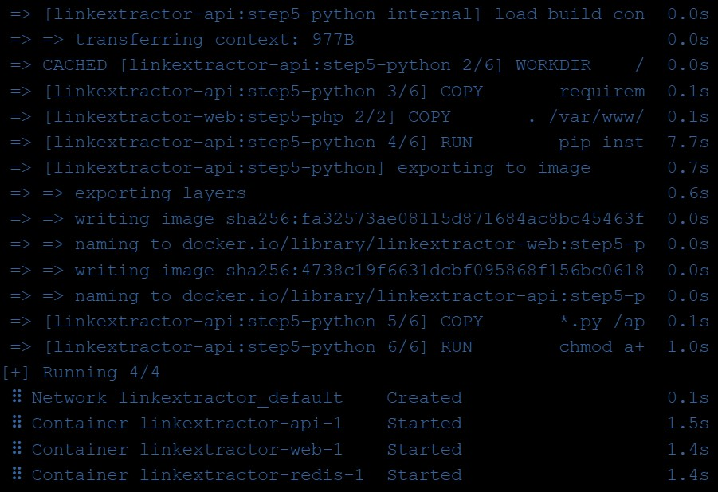
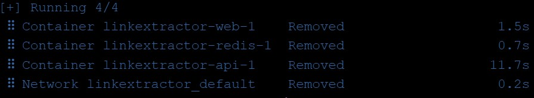

# Step 5: Redis Service for Caching

``git checkout step5``

``tree``

``cat www/Dockerfile``

``cat api/main.py``

``cat docker-compose.yml``

``docker-compose up -d --build``

``docker-compose down``

