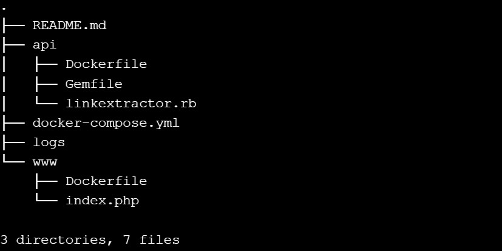
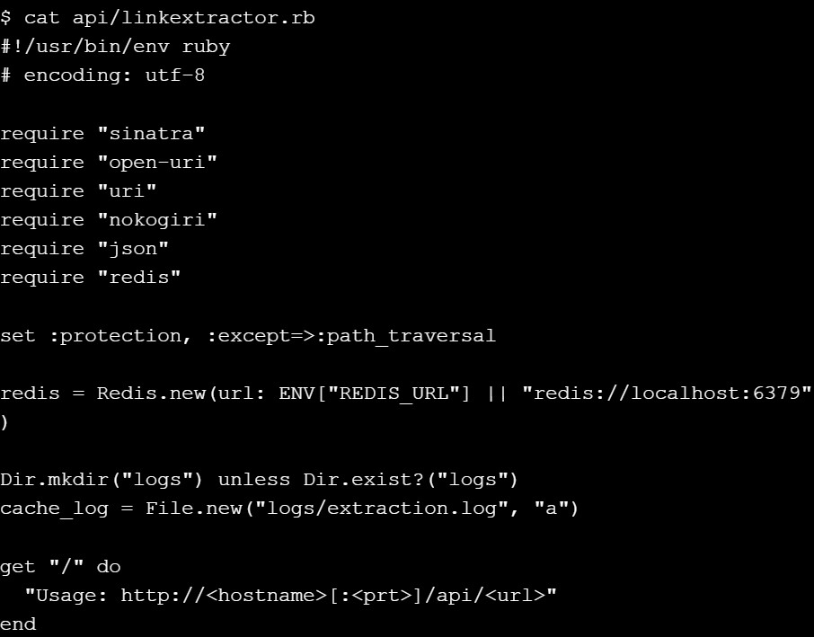
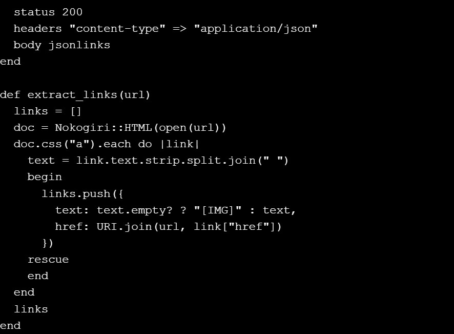
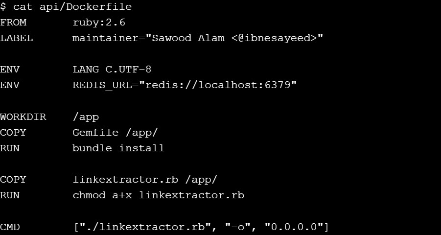
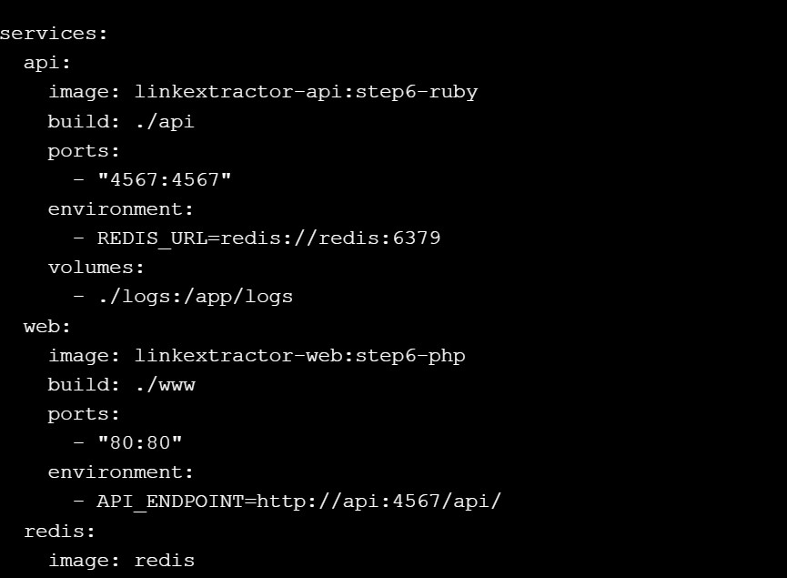
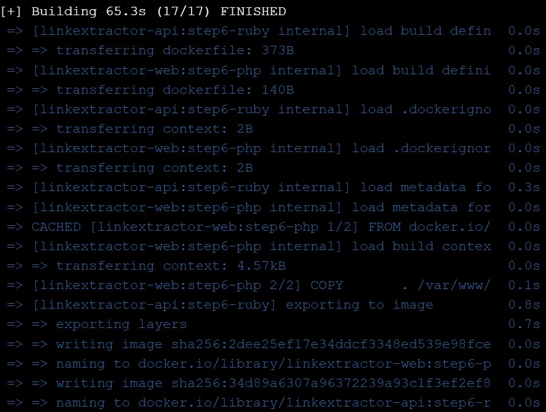
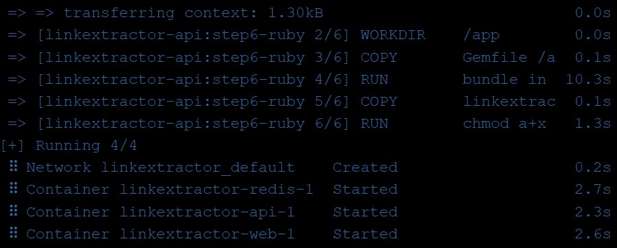
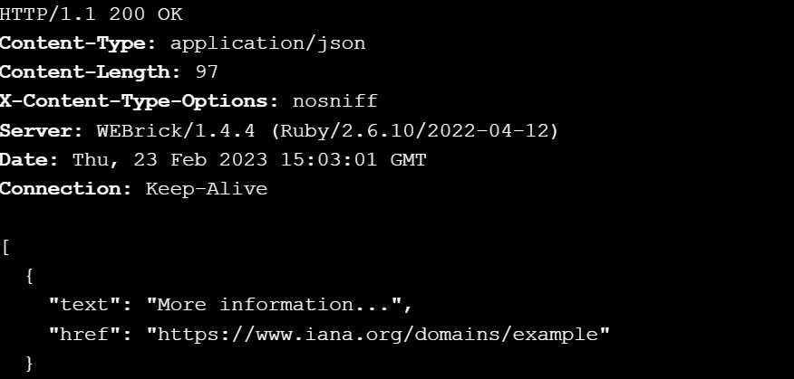
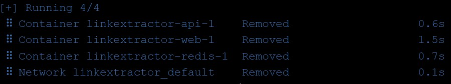
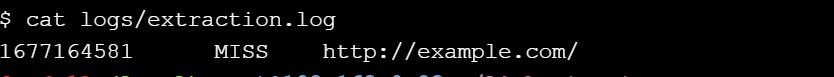

# Step 6: Swap Python API Service with Ruby

``git checkout step6``

``tree``

``cat api/linkextractor.rb``

``cat api/Dockerfile``

``cat docker-compose.yml``

``docker-compose up -d --build``

``curl -i http://localhost:4567/api/http://example.com/``

``docker-compose down``

``cat logs/extraction.log``

